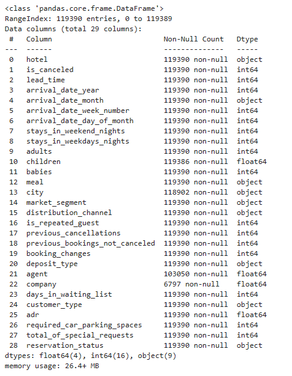
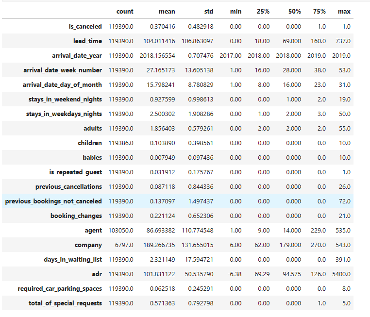
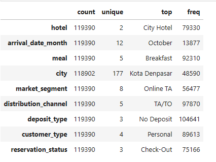
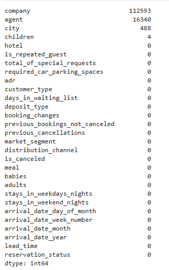
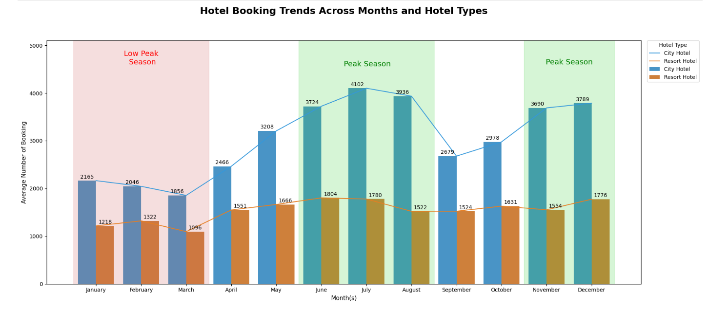
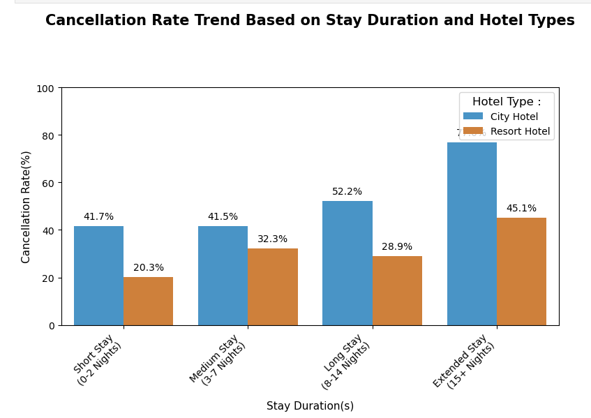
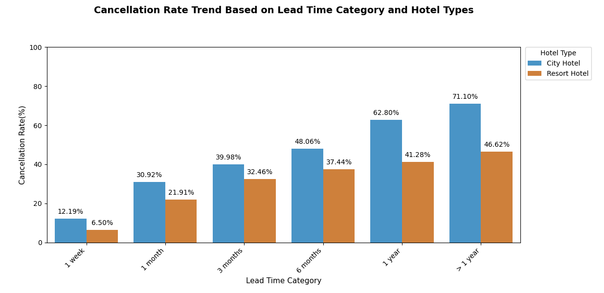

# Hotel-Business-Analysis-Data-Visualization

### Project Environment and Tools
- Tools: JupyterLab
- Programming Language: Python
- Libraries: NumPy, Pandas, Matplotlib, Seaborn
- Dataset: [hotel_bookings_data](hotel_bookings_data)

### Project Introduction
This project is the second mini project created by an expert tutor at Rakamin Academy. In this project, I will take on the role of a data analyst who performs an analysis of hotel booking data and presents it through data visualization.

### Table of Contents
1. [Business Understanding](#business-understanding)
    - [Problem Statement](#problem-statement)
    - [Objective](#objective)

2. [Exploratory Data Analysis](#exploratory-data-analysis)
    - [Dataset Information](#dataset-information)
    - [Statistical Summary](#statistical-summary)

3. [Data Preprocessing](#data-preprocessing)
    - [Handling Missing Value](#handling-missing-value)
    - [Handling Invalid Data](#handling-invalid-data)
    - [Removing Uneccesarry Value](#removing-uneccesarry-value)
    - [Feature Engineering](#feature-engineering).

4. [Data Analysis](#data-analysis)
    - [Monthly Hotel Booking Analysis Based on Hotel Type](#monthly-hotel-booking-analysis-based-on-hotel-type)
    - [Impact Analysis of Stay Duration on Hotel Bookings Cancellation Rates](#impact-analysis-of-stay-duration-on-hotel-bookings-cancellation-rates)
    - [Impact Analysis of Lead Time on Hotel Bookings Cancellation Rate](#impact-analysis-of-lead-time-on-hotel-bookings-cancellation-rate)

## :pushpin: Business Understanding
---
### **a. Problem Statement**
For a company, it is crucial to consistently analyze its business performance. In this endeavor, we will delve into the hospitality industry, specifically focusing on understanding customer behavior in hotel reservations and its correlation with booking cancellation rates. The insights we uncover will be presented through data visualizations to enhance comprehension and persuasive communication.

### **b. Objective:**
The main objective of this project is to analyze customer behavior patterns in hotel reservations and their association with booking cancellation rates. By examining the dataset, we aim to identify trends, factors, and potential insights that contribute to booking cancellations, ultimately helping businesses make informed decisions.

## :pushpin: Exploratory Data Analysis
---
### **a. Data Information**

The dataset consists of 29 columns and 119,390 rows spanning the period from 2017 to 2019.

### **b. Statistical Summary**
Statistical Summary of Numerical Data Columns

Statistical Summary of Categorical Data Columns
  

## :pushpin: Data Preprocessing
---
### **a. Handling Null Value**

There are 4 columns with null values in the dataset:

- **Children** Column: Contains null values in 4 rows, which is 0.003% of the total data.
- **City** Column: Contains null values in 488 rows, which is 0.408% of the total data.
- **Agent** Column: Contains null values in 16,340 rows, which is 13.686% of the total data.
- **Company** Column: Contains null values in 112,593 rows, which is 94.307% of the total data.
  
To address these missing values, we can fill numerical columns (`Children`, `Agent`, `Company`) with the value 0, and fill the "City" column with the label "unknown".

### b. Handling Invalid Data
Invalid values are present in the `meal` column, specifically the value 'undefined'. This value will be replaced with 'No Meal' because 'undefined' cannot be interpreted as one of the meal types. Replacing it with 'No Meal' will make the data more consistent and avoid misinterpretations.

### c. Removing Uneccessary Value
At this stage, data that appears to be illogical will be removed, such as rows with values of 0 in the columns `adults`, `children`, and `babies`, as this indicates that no guests are present. Next, rows with a value of 0 in the `adults` column but > 0 in the `children` or `babies` columns will be removed. This is done because it is unlikely for underage children to stay at a hotel without being accompanied by adults. Lastly, rows with negative values in the `adr` column will be deleted.

### d. Feature Engineering
Several features were added to facilitate the analysis:
- The `total_guests` column was created to calculate the total number of guests, obtained by summing the values in the `adults`, `children`, and `babies` columns.
- The `total_stays` column was introduced to calculate the total stay duration, calculated by summing the values in the `stays_in_weekend_nights` and `stays_in_weekdays_nights` columns.
- The `lead_time_category` column was generated to categorize values in the `lead_time` column for easier analysis.

## :pushpin: Data Analysis
---
### a. Monthly Hotel Booking Analysis Based on Hotel Type
This analysis focuses on examining the booking trends for each type of hotel.

Intepretation:
Based on the plot above, it can be observed that the _lowest hotel bookings_ (low season) for both city hotels and resort hotels occur during the months of _January_, _February_, and _March_. In contrast, the _peak season_ falls between _June_, _July_ and _August_, as well as _November_ and _December_. This pattern is likely influenced by the fact that the months of June to August coincide with school vacations and the Eid al-Fitr holiday, leading to a higher probability of people taking time off and making hotel reservations. Similarly, November and December, being school semester breaks and encompassing the Christmas and New Year holidays, also experience a peak in bookings.

### b. Impact Analysis of Stay Duration on Hotel Bookings Cancellation Rates
This analysis aims to observe the trend or correlation between the duration of stays and the booking cancellation rates.

Intepretation:
Across both hotel types, a distinct trend emerges that sheds light on the relationship between stays duration and booking cancellations. Notably, as the duration of stays extends, the probability of reservations being canceled also sees an upward trajectory. This pattern suggests a potential correlation between guests opting for longer stays and the higher chances of eventual booking cancellations. The insights garnered from this analysis can guide hotel management in tailoring their strategies and policies, considering the influence of stays duration on the booking cancellation dynamics.

### c. Impact Analysis of Lead Time on Hotel Bookings Cancellation Rate
This analysis focuses on examining the trend and correlation between lead time (the time interval between booking a hotel and the arrival date) and the hotel booking cancellation rate.

Intepreration:
The analysis reveals an interesting pattern in booking cancellation rates based on the lead time. Reservations made with a lead time of less than 1 week demonstrate the lowest cancellation rates, implying that guests tend to follow through with their plans when booking closer to their stay dates. This can be attributed to the increased certainty of travel plans for short-term bookings.

In contrast, reservations made significantly in advance, with a lead time of 1 year or more, show the highest cancellation rates. This might be due to changing circumstances, evolving plans, or unforeseen events that lead guests to reconsider or modify their booking choices over extended periods.

